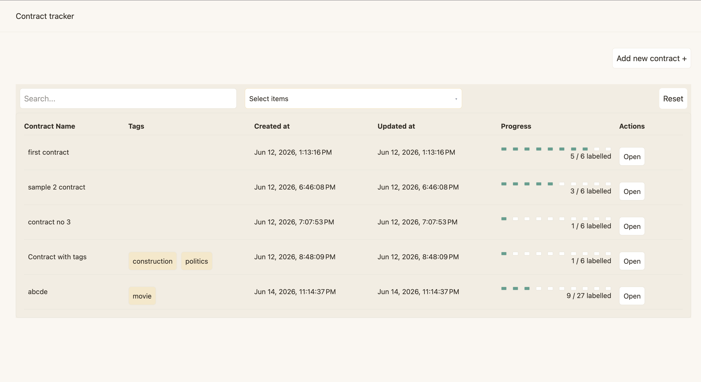
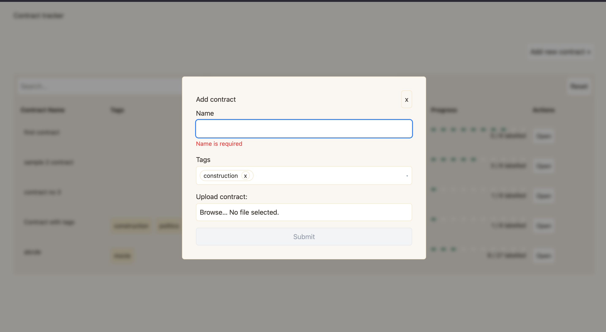
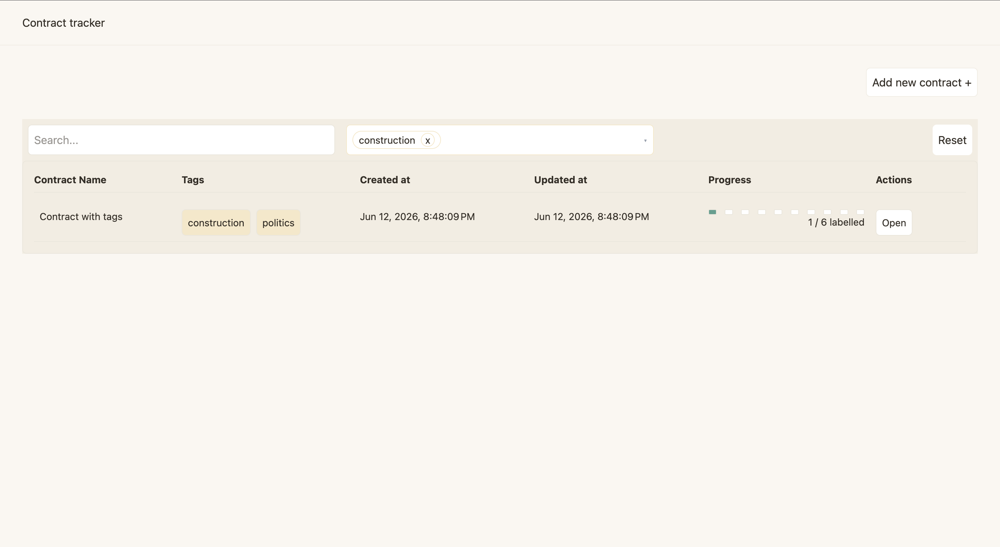
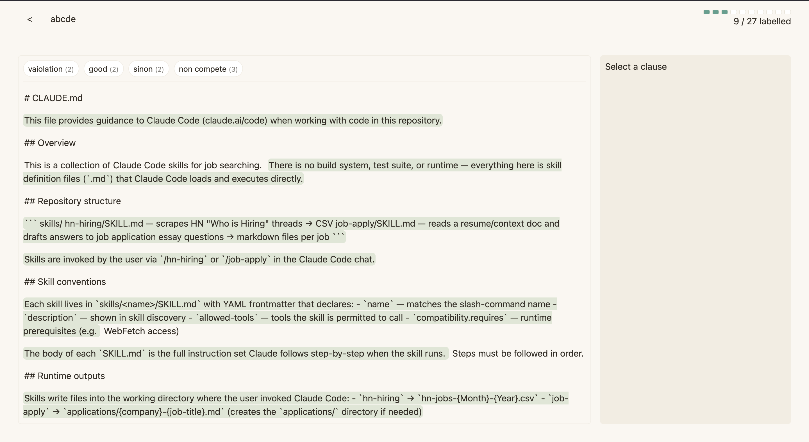
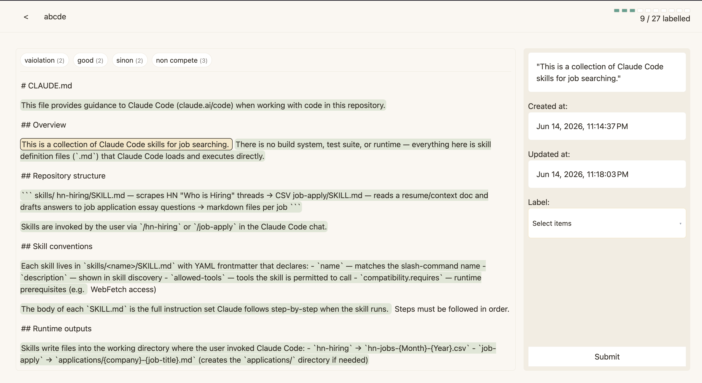
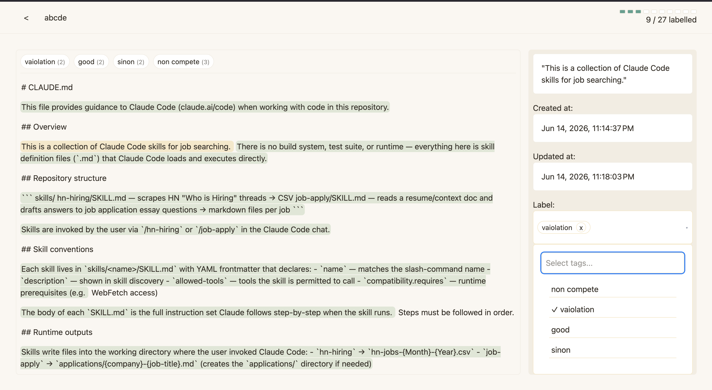
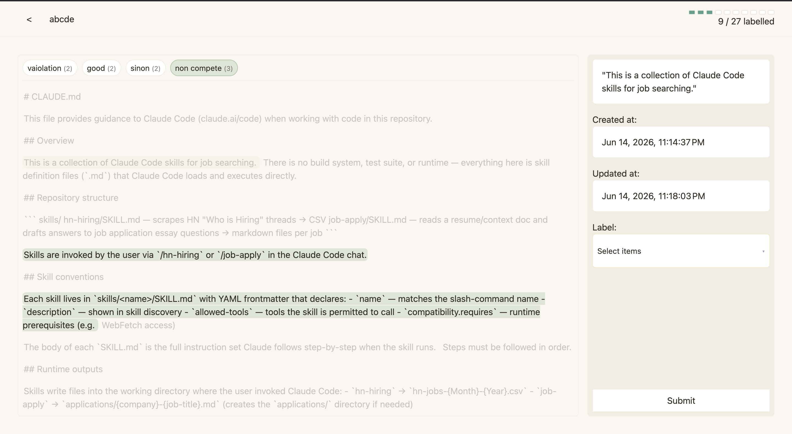
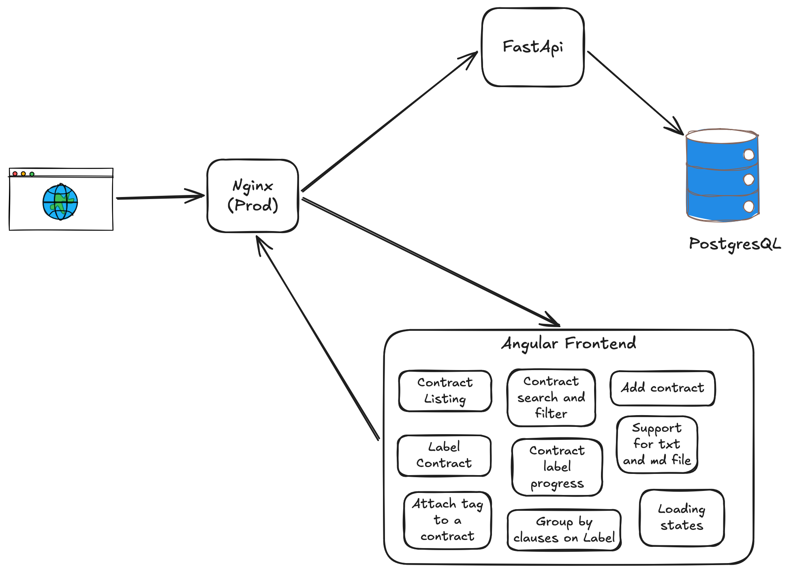
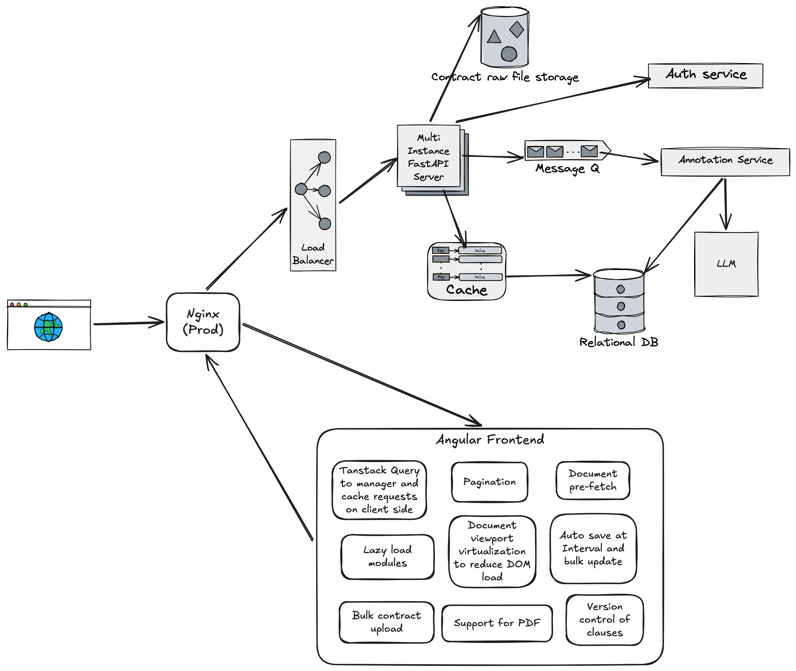
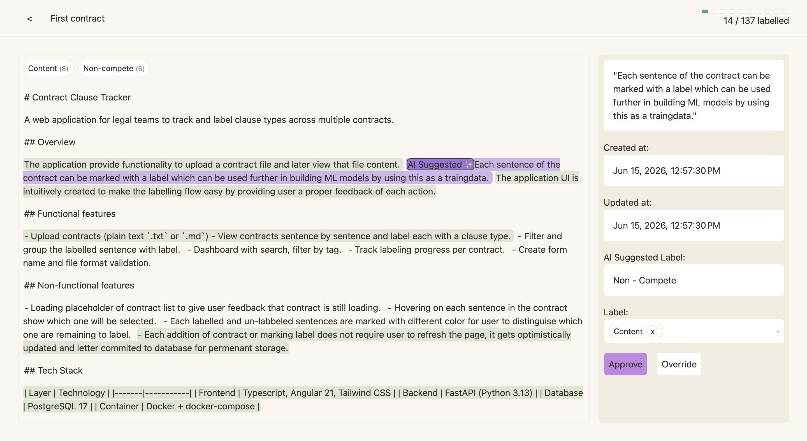

# Contract Clause Tracker

A web application for legal teams to track and label clause types across multiple contracts.

## Overview

The application provide functionality to upload a contract file and later view that file content. Each sentence of the contract can be marked with a label which can be used further in building ML models by using this as a traingdata. The application UI is intuitively created to make the labelling flow easy by providing user a proper feedback of each action. 

## Functional features

- Upload contracts (plain text `.txt` or `.md`)
- View contracts sentence by sentence and label each with a clause type.
- Filter and group the labelled sentence with label.
- Dashboard with search, filter by tag.
- Track labeling progress per contract.
- Create form name and file format validation.

## Non-functional features

- Loading placeholder of contract list to give user feedback that contract is still loading.
- Hovering on each sentence in the contract show which one will be selected. 
- Each labelled and un-labbeled sentences are marked with different color for user to distinguise which one are remaining to label.
- Each addition of contract or marking label does not require user to refresh the page, it gets optimistically updated and letter commited to database for permenant storage. 

## Tech Stack

| Layer | Technology |
|-------|-----------|
| Frontend | Typescript, Angular 21, Tailwind CSS |
| Backend | FastAPI (Python 3.13) |
| Database | PostgreSQL 17 |
| Container | Docker + docker-compose |

## Getting Started

### Prerequisites

- [Docker](https://docs.docker.com/desktop/) and docker-compose installed

### Run with Docker

```bash
# Clone the repository
git clone <repo-url>
cd clause-tracker

# Copy environment file and fill in values or leave defaults for local dev
cp .env.example .env

# Start all services
docker-compose -f docker-compose.yaml -f docker-compose.dev.yaml up --build
```

The app will be available at:
- Frontend: http://localhost:4200
- Backend API: http://localhost:8000
- API docs: http://localhost:8000/docs

### Run in Production Mode

```bash
docker-compose -f docker-compose.yaml -f docker-compose.prod.yaml up --build
```

Frontend served at http://localhost:80.

## Screenshots

Dashboard


Create contract dialog


Tag filtered view


Contract editor initial screen


Selected clause screen


Clause label editor


Clause filtering


## Project Structure

```
clause-tracker/
├── backend/          # FastAPI app
│   ├── controller/   # Route handlers
│   ├── mutations/    # Write operations
│   ├── queries/      # Read operations
│   ├── parsers/      # File parsing logic
│   ├── schemas/      # Pydantic models and SQLAlchemy ORM models
│   ├── database.py   # DB setup and session management
│   └── main.py       # App entry point
└── frontend/         # Angular app
    └── src/app/        
        ├── components/ # Core components of app
        ├── services/   # Injectable services
        ├── models/     # Resource types
        └── pipes/      # Inline modifiers for template
```

## Current Design


## Design Decisions

### Decision 1 — Separate Clause model for storing clause of each contract
Contract can have multiple clauses and storing their raw text file and processing it on front end will be an too much overhead for frontend. I did not choose to store those sentences in the same contract table as it will clause problem in update operation if multiple items in the same column. So based on the 1NF each sentence of the contract is stored separately in Clause table with foreign key reference to connect them together. Now every clause labelling update does not have to deal with contract table and it can be easily updated without any merge operations. This do require a join operation in case we need all clause and contract together but design choise is made by keeping in mind that there will be more update operation than read operation. 

### Decision 2 - Not storing the original file in storage
For the purpose of the mvp I skipped the object storage part to keep the system simple. But for scalling this will be useful in terms of we need to reference the original document back. Also storing would have been more beneficial for pdf files. 

### Decision 3 — Why Tags used for contracts
These tags are not part of the labelling or annotation, it can be used but this was mostly added to filter or group contrats based on tag values. 

### Decision 4 — Injectable services instead of managing state in individual component
For most of the resources like contract, clause, tags etc I have created a seperate Injectable services which let me use those searvice methon in any of the component. And keep the component state management clean in terms of using it for only component local state. This let me share state between different component without props and allow me to reflect any crud operation and get the updated state of data. This works well for small system like this prototype but it can cause problem in bigger application. Because this service can be mutated by any component and there is no history of who made the update which makes application debugging hard. For bigger application NgRx or other similar central store na be used. 

### Decision 5 - Loading state on component before data is received
Loading state was added intermediatary to show user that something is happening on the page, its a important user feedback. This solves problem of transient blank screen when data is loading. Once the data is available it fills up UI with real data. Currently in my prototype I am tracking statelevel loading signals. But it will not scale if there are multiple section of component require loading in different way (which require managing multiple state). To support in larger app, using query manager like Tanstack Query (similar to React Requer) to track each individual resource's loading state. 

### Decision 6 - Why adding a new Tags and Label from item selector is supported
To make system more open instead of defining predefined Tags and Labels it is more useful to create those resources in case it is not available. And once it is created it can be used in future selection. Also this is added as a part of selection process only so that user do not have to jump between multiple screens to create one single resource. This approach required more steps to sync back the created resource and use that new resource. 

### Decision 7 - Split panes UX in the contract editor
Clicking on sentence immideately show the information about the sentence and their existing label on the right pane. This let user see which sentence they are working on. Alternate approach would be to open a modal on top of the page but that will block the view of current document.

### Decision 8 - ContextService for Navbar and ContractEditor communication
At top of the navbar I wanted to show which contract is being presented, their progress till now. The navbar lives outside of router outlet and it would have require to do prop-drilling to send that data back to navbar. So to hold the active state of contract I introduced this ContextService which can be used for other purposed as well but for now I have only used for contract. With this I can manage when to load the data in contract service and that data will be picked up by other component if needed. The main trade off is similar to using other injectable is that anyone can mutate the state and no history tracking but it serves the purpose in small application.

### Decision 9 - forkJoin for parallel data loading in ContarctEditor
When opening contract editor I require many data to show on the page which includes, clasues, contract and labels. With forJoin I can fire them parallelly and manage state udpate once all the data is received. With this I can control loading state of the editor component. This make the onInit hook clean by managing single observer. The drawback of the approach is I am making network request from client, which can be solved if I create a seperate endpoint and make parallel call from backend. Or even better use GraphQL to orchastrate the data. But it will increase the scope of the prototype.

### Decision 10 - Custom MultiSelect implementation with ControlValueAccessor
Insead of adding a new UI library, I wanted to showcase my re-usable component designing skill, and for that I created this MultiSelect component. This selector have various state like change in selected items, addition of new items etc. That requires many signal for parent as well and prop drilling. So to make it seamlessly usable in formGroup, I implemented it with ControlValueAccessor, which makes it easy to manage state by just using formControlName similar to what we use with input. It does make the component bit complex but the ease of use make all that efforts worth it.

### Decision 11 - computed() signals for search/filter instead of handling on change event
Filtered contracts is a computed signal which is derived from search query and tags list. Angular re-evaluate it automatically once the signal vlaue changes. Another approach would be a pipe cretation for filtering but the state of filtering is available in list component and passing arguments can become messy in pipe.

### Decision 12 - Standalone components
To simplyfy mental modal that each component will have their own imports and also is an best practice from Angular. With NgModule, I would have to declare everything seperately (too much boilerplate) and its hard to maintain and test. 

### Decision 13 - Multiple operations are wrapped with Transaction contextmanager
On backend side for few option like creating a Contract, which require and db update on Contract_tag mapping and also creation of clause entries. These operations are atomic individually but they are still a separate call. So to make sure if any of the operation fails we have a way to rollback. So python context manager was useful to create transaction context and if any of the operation fails rollback is called on db. Each individual operation does not call commit to not updated the changes on db yet, keep it in proxy. But the changes will be commited in the transaction at once.

## API Endpoints

| Method | Path | Description |
|--------|------|-------------|
| GET | `/api/v1/contracts` | List all contracts |
| POST | `/api/v1/contracts` | Upload a new contract |
| GET | `/api/v1/contracts/:id` | Get a single contract |
| PUT | `/api/v1/contracts/:id` | Update contract name/tags |
| GET | `/api/v1/clauses?contract_id=` | Get clauses grouped by paragraph |
| PUT | `/api/v1/clauses/:id` | Assign a label to a clause |
| GET | `/api/v1/labels` | List all clause labels |
| POST | `/api/v1/labels` | Create a new label |
| GET | `/api/v1/tags` | List all tags |
| POST | `/api/v1/tags` | Create a new tag |
| GET | `/api/v1/progress` | Get labeling progress per contract |

## How I'd Extend This

## Scaled design with AI automation


### Scaling
On Backend side, we have to scale the service and database to efficiently server the data and http request. 
- REST requests are stateless, so they can be easily scales by multiple instances of container and load balancer.
- Add support for authentication flow to auditing user data and governance. 

For relational database there are various options.
- First to manage huge amount of data we can shard the data in multiple databases (e.g sharding based on contract name). 
- Currently each new request opens a new connection, which take some time initially, we can have a connection polling to get results quickly without waiting to connect. 
- To make queries faster we can index the columns, in the current implementation there are not a lot of join operation but indexing can be useful at scale.
- To reduce the database requests we can introduce a caching layer to reduce db request for frequenly used data. 
- We can store documents in object storage for future auditing or other operation on same document. 

On Frontend side, there are various refactoring nedded.
- Use query libraries to have better control on data loading state, we can also use them to cache data on the client side to reduce making network requests. This can be useful in case we add pagination feature as we can cache the previous page so that when user click previous we don't need to make a network request.
- Have a pagination component, to easily go through contracts items if the list of contracts are very high.
- To load content faster while opening Contract editor we can pre-fetch the data before user take the action. like user hover on open button.
- Lazy load the component based on route to reduce the size of bundle.
- If the document is huge and while editing instead of loading all data at once we can do vertulization to only load the part of the content on the viewport to reduce the load on the DOM. 
- We can have a interval saving on contract editor page to bulk save the data, so it requires to keep a local copy of the data.
- Support for bulk contract upload
- Support for formatted document like pdf and docx, we can use doc to html parser to get a dom and it that for marking clauses.  

### AI Features
- When we parse the contract document in the backend we can process the document in a batch with LLM model with a system prompt listing instruction on how to parse and known label for the clauses. This will return a suggested label for each clause with confidence score. Which later user can confirm or overide it.
- So in this case the label assigning will need an intermediatery state something like draft which user can review or override it and move it into complete state. 
- On the frontend side we can distinguise each label marked by AI in a different color like orange and whichever is approved by user will be marked as green so that user will know which one are done. Same for the process bar, instead of all green it should have green, orange and white bars to show each of the progress.
- One more thing is when we make AI to label the clauses the process can take time. On this case we need a message queue to process the data and also store the contract data in pending state. Once the data is processed it can be marked as done and user can audit it. 

#### Sample UI with Auto labelling


### Other Improvements
- Authentication support and auditing user changes. With authorised user we can track those user data on database like who updated the contract or clause. We need a User table.
- Support for bulk contract upload.
- Pagination for contract
- Audit history for the label changes on the clause, means we can have a versioning mechanism and audio previous change history as well.
- UI monitoring to see user experience and UI issues
- Logs to track issue and failures

## Running Tests

```bash
# Frontend
cd frontend
pnpm test
```
